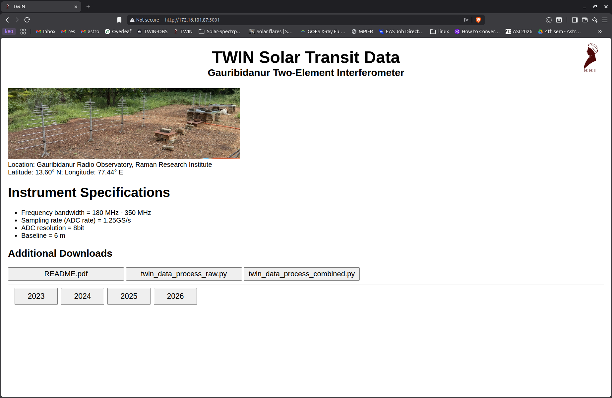
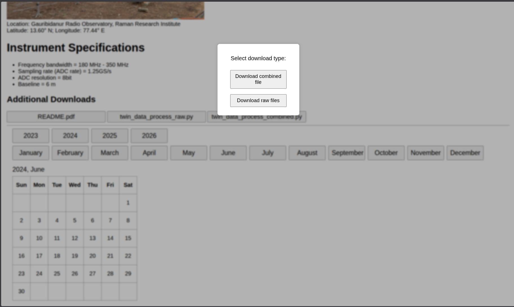
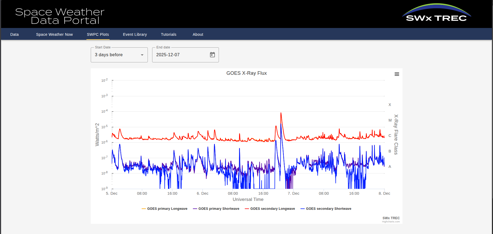
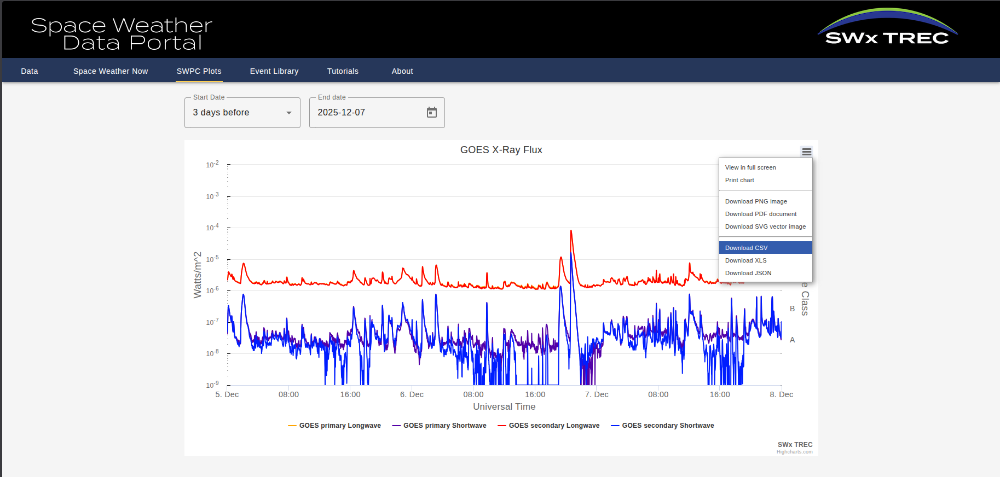
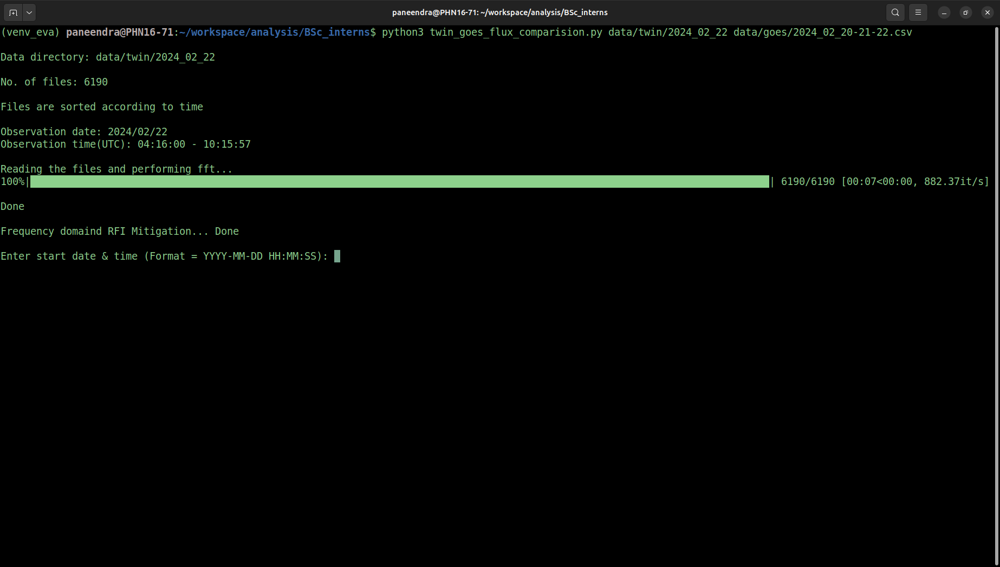

# SOP for plotting the TWIN data
Data processing of TWIN array at Gauribidanur Radio Observatory (RRI)<br>
Author: G N Paneendra

## TWIN array details:<br>
Location: Gauribidanur Radio Observatory<br>
Latitude: 13.60° N; Longitude: 77.44° E<br>
Baseline: 8.5m<br>
Operating Frequency: 180 - 350 MHz<br>

## Setting up python
Follow the instructions for running the program

Open the terminal<br>
ctrl+alt+T

```terminal
sudo apt update
```
Check Python version
```terminal
python3 --version
```
Example output = Python 3.12.3<br>
Give the python-venv version according to your python version
```terminal
sudo apt install python3.12-venv
```
Create a python virtual environment, venv_twin is the name of the environment
```terminal
python3 -m venv venv_twin
```
Activate virtual environment
```terminal
source venv_twin/bin/activate
```
Installing python packages
```terminal
python3 -m pip install numpy pandas matplotlib datetime tqdm
```

## Downloading the data

### Download thw TWIN data

Go to a web browser (Firefox) and enter 

```terminal
172.16.101.87:5001
```
Webpage will appear as below and select the year, followed by month and date<br>


After selecting the date, a dialogue box appears and you have to select "Download raw files"<br>


Once the download is finished, remember the location of the downloaded file. For example, if the file is located in the Downloads folder, then your file location will be
```terminal
/home/winterschool/Downloads/example_name
```
Replace example_name with your downloaded file name<br>

Unzip the downloaded data using the following command
```terminal
unzip example_name.zip -d example_name
```

### Downlaod GOES data

Open a new tab in the web broswer and paste the below link<br>

https://lasp.colorado.edu/space-weather-portal/goes-x-ray-flux?duration=3&endDate=2025-12-07<br>


A webpage like this will be visible<br>


Chose the data and click the 3 bars on thw right top of the plot and a drop down menu appears and select "Download CSV"<br>



Download the programs using git
```terminal
git clone https://github.com/gnpaneendra/TWIN_data_processing.git
```
```terminal
cd TWIN_data_processing
```
To see all the files in the directory
```terminal
ls -ltrh
```

twin_fullday.py plot the spectrograph, bandpass and total power (in arbitrary value)<br>

twin_goes_flux_comparision.py plot the spectrograph, bandpass and total power (in arbitrary value) along with the x-ray flux from GOES satellite for the selected time interval

## Running the programs


Execute the below command in terminal to get the plots of one full observation<br>

Type python3 followed by program name and path to TWIN data

```terminal
python3 twin_fullday.py /home/winterschool/Downloads/example_name
```
Execute the below command to compare the TWIN data with GOES data<br>

Type python3 followed by program name, path to the TWIN data and GOES data

```terminal
python3 twin_goes_flux_comparision.py /home/winterschool/Downloads/example_name /home/winterschool/Downloads/goes_data.csv
```

After the execution of the program, you have to type the start date & time then press enter and type end date & time and type enter just like below <br>


Contact details: paneendra.res@gmail.com
